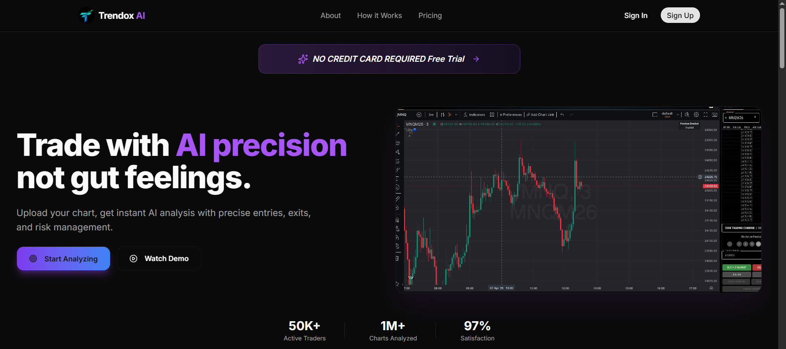
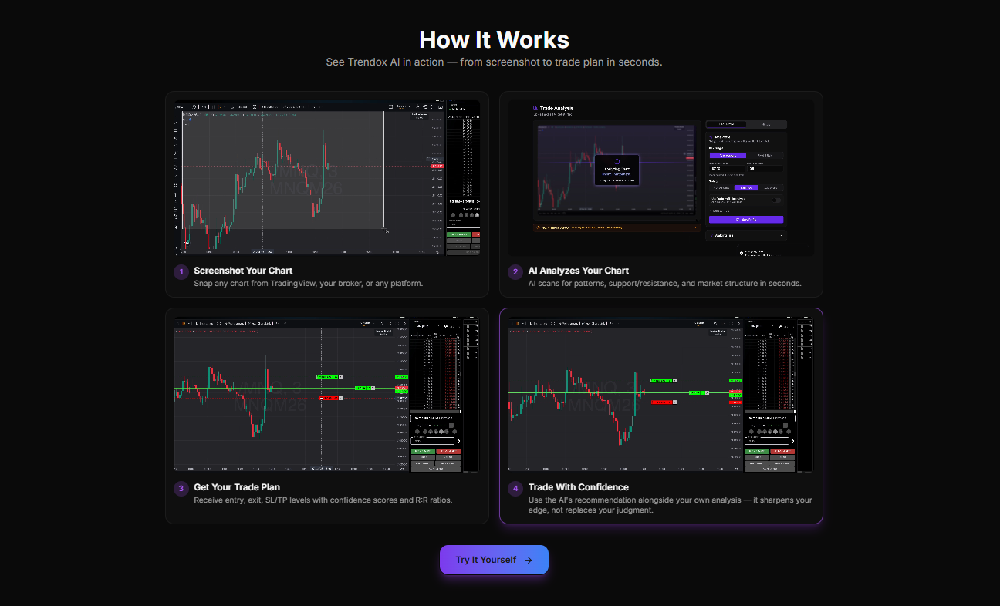
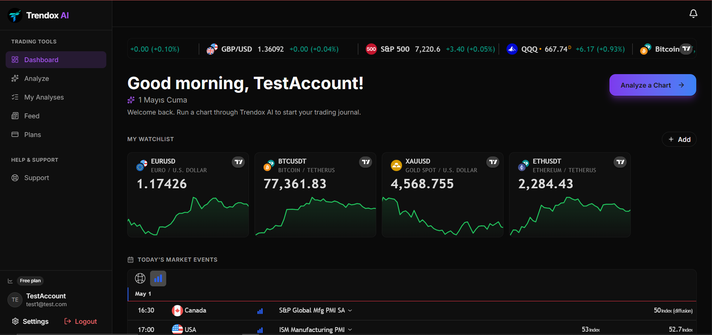
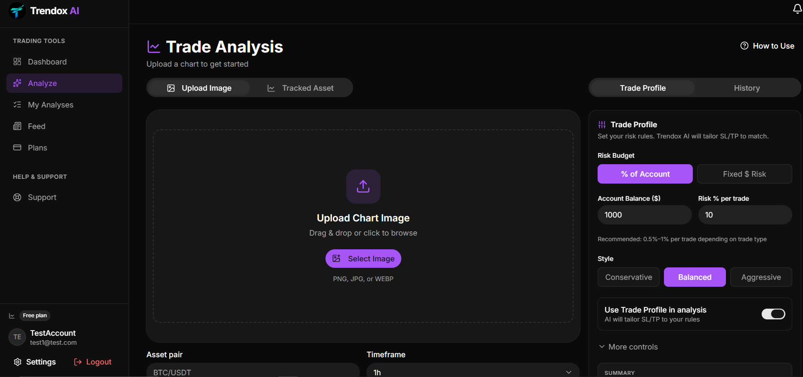
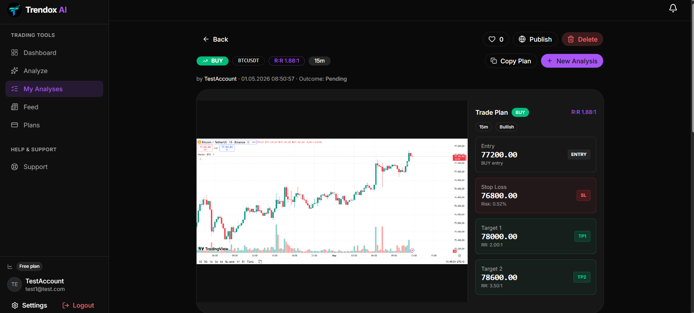

# Trendox AI

AI-powered trading analysis platform. Upload a chart screenshot or pick a tracked asset, and a large language model returns a full breakdown — trend direction, entry / stop-loss / take-profit levels, support / resistance, and a written analysis. Outcomes are tracked automatically against live market data.

This is an end-to-end full-stack project built as a portfolio piece to demonstrate building, shipping, and operating a non-trivial system from scratch.

---

## Screenshots

### Landing page


### How it works (4-step flow on the marketing page)


### Dashboard (live ticker tape, watchlist mini-charts, market events)


### Analyze — upload a chart, set risk profile


### Analysis result — chart + trade plan


### Analysis result — AI breakdown


---

## Why this project

I built Trendox AI because:

- I wanted a project that exercises every layer of a real product — not just a CRUD tutorial. Auth, async background work, third-party APIs (vision LLM, market data), payments-shaped subscription gating, social features, deployment.
- Trading platforms are a domain I find genuinely interesting, and the AI + chart analysis combination is a credible product idea — not toy-shop demoware.
- I wanted concrete proof that I can take a backend-heavy idea and put a working web product around it that someone other than me can actually use.

The goal was learning depth, not unit-economics. The "subscription" tiers are a UX-complete flow but no payment processor is wired up — by design.

---

## Who built it

**Aykut Kaan Altundal** — .NET / backend developer.

The **backend**, **architecture**, **database design**, **AI integration**, **outcome-tracking worker**, and **deployment** are my work. This is the part of the codebase I want recruiters and interviewers to evaluate.

The **frontend (React + TypeScript)** was generated and iterated through pair-programming with **Claude (Anthropic's coding assistant)**. I don't want to misrepresent my skills — frontend isn't my strength yet, and I leaned on the assistant to cross the React / TanStack Query / Tailwind / shadcn learning curve in days instead of months. I drove the product decisions, layout, and review — but the bulk of the JSX/TSX was AI-generated under my direction. Treat the frontend as "I shipped a frontend with help" and the backend as "I built this myself."

---

## What it does

- **Upload a chart image** → AI vision model returns trend direction, key levels, entry/SL/TP, and a written analysis
- **Tracked-asset analysis** → AI gets fed live price + recent OHLC for a curated list of crypto / forex / stocks and returns the same breakdown
- **Outcome tracking** → background worker polls historical candles every 5 minutes, marks analyses as Win / Loss / Expired when a level hits, and emails the user on wins
- **Trade Profile** → user-configurable risk rules (account size, % per trade, style, target count, min R:R) sent to the AI as additional context
- **Social feed** → publish your analyses, like and comment, follow other traders, see a "Following" feed of their published work
- **Dashboard** → live ticker tape and watchlist powered by TradingView embeds, recent analyses, economic calendar
- **Subscription tiers** → Free (3 lifetime analyses), Pro ($9.99 / mo, 30 / day), Premium ($29.99 / mo, unlimited). Hard-coded prices; no payment processor wired up.
- **Notifications** → bell with unread count, polling-based
- **Settings** → edit profile, upload avatar, change password
- **Auth** → JWT access + refresh tokens, transparent token refresh on 401, optimistic UI updates throughout

---

## Architecture

```
tradingai-web/                  React + Vite + TypeScript SPA
src/
  TradingAI.API/                ASP.NET Core minimal API + controllers
  TradingAI.Application/        MediatR commands/queries, FluentValidation, DTOs
  TradingAI.Domain/             Entity classes, enums, no dependencies
  TradingAI.Infrastructure/     EF Core, JWT, BCrypt, Polly, AI client,
                                market-data clients, file storage, email,
                                cache, outcome worker, seeders
tests/                          xUnit unit + integration tests
```

### Backend stack

- **.NET 10** / ASP.NET Core
- **Clean Architecture** — Domain has no deps; Application depends on Domain only; Infrastructure & API depend on everything
- **MediatR** for CQRS — every business action is a command or query with a handler
- **FluentValidation** wired into the MediatR pipeline as a behavior
- **Pipeline behaviors** for rate-limit gating (free tier = 3 lifetime, paid tiers = daily) and validation
- **Entity Framework Core 10** + **Npgsql** for PostgreSQL
- **BCrypt** for password hashing
- **JWT** with refresh tokens, rotating refresh on use
- **Serilog** for structured logging
- **Polly** for retry / circuit-breaker / timeout on outbound HTTP (CoinGecko, TwelveData)
- **MailKit** for SMTP (Mailtrap sandbox in dev)
- **Redis** (StackExchange.Redis) for live-price caching — optional, falls back to a no-op cache when absent
- **HostedService** background worker for outcome tracking — same process, independent scope per tick

### AI integration

- OpenAI-compatible client (`OpenAI.Chat`) pointed at **xAI Grok** or **Groq** (the BaseUrl is config-driven)
- Vision-capable: chart screenshots are passed as image parts alongside the text prompt
- A strict system prompt enforces:
  - Bias rules (default to dominant trend, don't call reversals without an explicit pattern)
  - Trade-level sign rules (SL below entry for longs, etc.) so the model can't return contradictory levels
  - JSON-only output with a fixed schema
- Temperature is set to 0 for determinism

### Frontend stack

- **React 19** + **Vite** + **TypeScript**
- **TanStack Query** for server state, **Zustand** for client/auth state (with `persist` middleware)
- **react-hook-form** + **Zod** for forms
- **Tailwind v4** + **shadcn/ui** components
- **react-router-dom v7** with nested routes and a `ProtectedRoute` gate
- **Sonner** for toasts
- **TradingView embed widgets** for live ticker tape and watchlist mini-charts (no custom data plumbing for those)

### Database

PostgreSQL with EF Core code-first migrations. Schema covers: users, refresh tokens, analyses, analysis likes / comments, user follows, watchlist items, assets, subscription plans, user subscriptions, notifications.

### Deployment

- Backend: **Railway** (Docker image from the repo root `Dockerfile`, .NET 10 SDK build → ASP.NET runtime, with `libgssapi-krb5-2` installed for Npgsql)
- Database: **Railway Postgres**
- Frontend: **Vercel** (root `tradingai-web`, Vite build, static serve)
- Migrations run on startup; reference data (asset list, subscription plans) is upserted by seeders so price tweaks land without manual SQL

---

## Running it locally

### Prerequisites

- .NET 10 SDK
- Node 22+
- Docker (recommended) or local PostgreSQL 16

### Quickest path: Docker Compose

```bash
cp .env.example .env
# Fill in real values for GROK_API_KEY, JWT_SECRET, etc.
docker compose up --build
```

Open:

- Frontend: http://localhost:5173
- API: http://localhost:8080
- Postgres: localhost:5432 (postgres / admin)

### Manual

```bash
# Backend
cd src/TradingAI.API
dotnet run

# Frontend (new terminal)
cd tradingai-web
npm install
npm run dev
```

Real secrets go in `appsettings.Development.json` (gitignored). See `.env.example` for the variable list.

---

## Deploying

See [`DEPLOY.md`](DEPLOY.md) for the full Railway + Vercel walkthrough.

The short version:

1. Railway: import GitHub repo, add Postgres plugin, paste env vars, generate domain
2. Vercel: import GitHub repo with root `tradingai-web`, set `VITE_API_URL` to the Railway domain
3. Loop back to Railway: add the Vercel domain to `Cors__AllowedOrigins__0`

---

## What I learned

- **EF Core 6+ is strict about DateTime kinds.** Postgres `timestamptz` rejects `Kind=Unspecified`. The fix is either to mark every `DateTime` `Kind=Utc` at the source or set the `Npgsql.EnableLegacyTimestampBehavior` switch — I went with the latter and documented why.
- **Pipeline behaviors are the right place for rate limits.** It's tempting to put rate-limit checks inside each handler. Putting them in a `RateLimitBehavior<TRequest, TResponse>` keyed on a marker interface (`IUsesDailyAnalysisSlot`) keeps handlers clean and the policy in one place.
- **Don't let third-party APIs hang your endpoint.** When CoinGecko/TwelveData were flaky, the watchlist endpoint took 48 seconds to return because every call retried the full timeout. Wrapping provider calls in a per-call timeout + try/catch + null fallback turned a hard failure into a soft "no price this tick" while keeping the rest of the response valid.
- **`AddHostedService<T>` is the cheapest way to run background work.** No need for a separate Worker project unless you want to scale it independently. Same process, same DI, same logs.
- **Redis-as-optional was the right call.** Hardcoding a hard dependency on Redis would have made deployment harder. `if (connectionString is set) { register Redis } else { register NullCacheService }` — boots without Redis, runs with it when configured.
- **The frontend's hardest problem is auth state, not UI.** Token refresh on 401 with an in-flight promise so concurrent requests share one refresh, optimistic updates that roll back on failure, route-level guards, "redirect back to where they came from" — these soaked up more time than any single page's design.

---

## Known limitations / next steps

- **No payment processor** — Plans page is UX-complete but nothing actually charges. Stripe Checkout would be the next addition.
- **No email verification on signup** — anyone can register with `fake@example.com`. Real launch would gate features behind email confirmation.
- **No password reset flow** — same reason.
- **No 2FA** — UI toggle is cosmetic.
- **File uploads are ephemeral on Railway free tier** — the container disk is wiped on every redeploy, so avatars and chart screenshots disappear. Production fix is S3 / Cloudflare R2.
- **AI prompt could be much better** — currently a single-shot prompt. Two-pass classifier-then-analyst, indicator pre-computation, and a confidence score would all help.
- **Outcome worker only handles tracked-asset analyses cleanly.** Image-uploads with arbitrary user-typed pairs that don't match a tracked Asset stay Pending forever (because we have no candle source for them). They should auto-mark as `Invalidated` after expiry.

---

## Disclaimer

This is educational software. The AI's analyses are not financial advice. The model can be wrong, miss context, or contradict itself. Always do your own research before acting on any output.

---

## License

MIT
